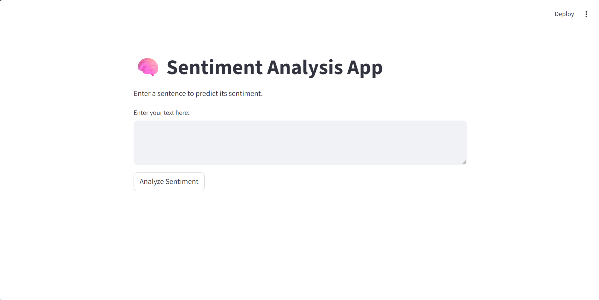
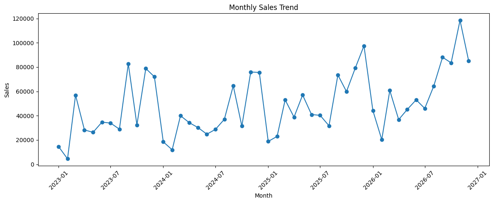

# Hi, I'm Abdul Rehman 👋

### Artificial Intelligence Undergraduate | Machine Learning | Deep Learning | NLP | Data Science

Building and exploring **AI/ML systems and data-driven applications** with Python, focusing on Machine Learning, Deep Learning, Natural Language Processing, RAG, and Data Analysis.

---

## 🛠️ Tech Stack

  

  

**AI / ML:** Scikit-learn • TensorFlow • NLP • RAG  
**Data:** Pandas • NumPy • Matplotlib • Seaborn  
**Development:** Python • SQL • Git • GitHub • Streamlit

---

## 🚀 Featured Projects

### 🧠 Sentiment Analysis System

An end-to-end **3-class sentiment analysis system** for social-media text using traditional machine learning and NLP techniques.

**Pipeline:** Text Preprocessing → TF-IDF → Model Training → Evaluation → Streamlit Deployment

**Models:** Logistic Regression • Multinomial Naive Bayes  
**NLP:** TF-IDF with unigrams and bigrams  
**Classes:** Positive • Negative • Neutral  
**Deployment:** Streamlit

The project also uses GPT for **qualitative validation and explanation**, while sentiment prediction remains ML-based.

<table>
  <tr>
    <td>
      
    </td>
  </tr>
</table>

---

### 📊 E-commerce Sales & Profitability Analysis

A data analysis project focused on uncovering **sales, profitability, customer, product, regional, and discount-related patterns** from transaction data.

**Analysis:** EDA • Feature Engineering • Sales Trends • Customer Analysis • Product Analysis • Regional Analysis • Correlation Analysis

**Tools:** Python • Pandas • NumPy • Matplotlib • Seaborn • Jupyter Notebook

<table>
  <tr>
    <td>
      
    </td>
  </tr>
</table>

---

## 📂 Other Projects

### 🌐 UMT Login Page

HTML-based login page inspired by the UMT student portal interface.

[View Repository](https://github.com/abdulrehmanml/umt-login-page)

[View Live Demo](https://abdulrehmanml.github.io/umt-login-page/)

---

## 🎯 Current Focus

- Machine Learning
- Deep Learning
- Natural Language Processing
- Retrieval-Augmented Generation
- Data Science & Data Analysis
- Building practical AI/ML applications

---

## 🔗 Connect

---

### ⚡ Building, learning, and turning AI concepts into working systems.
