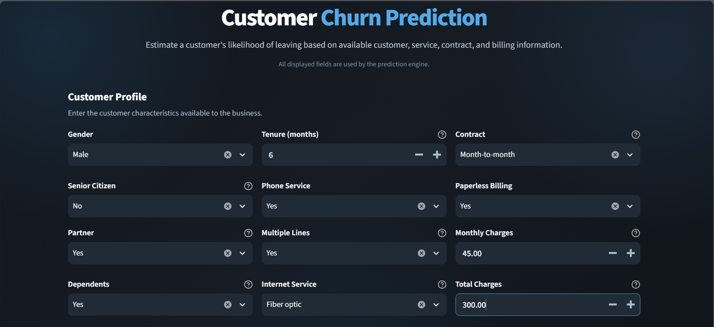
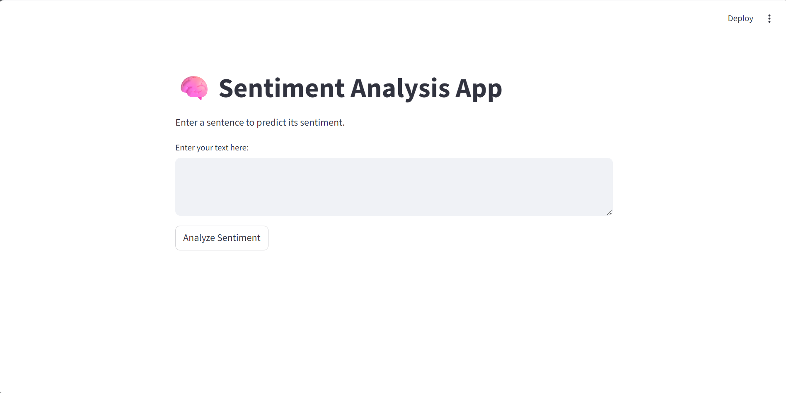
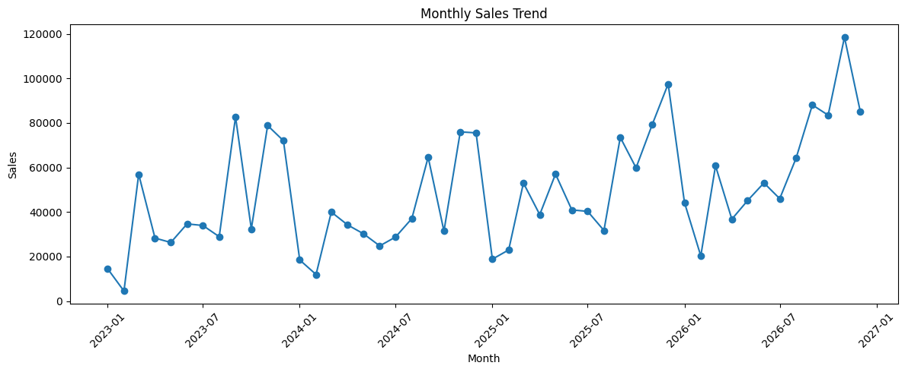
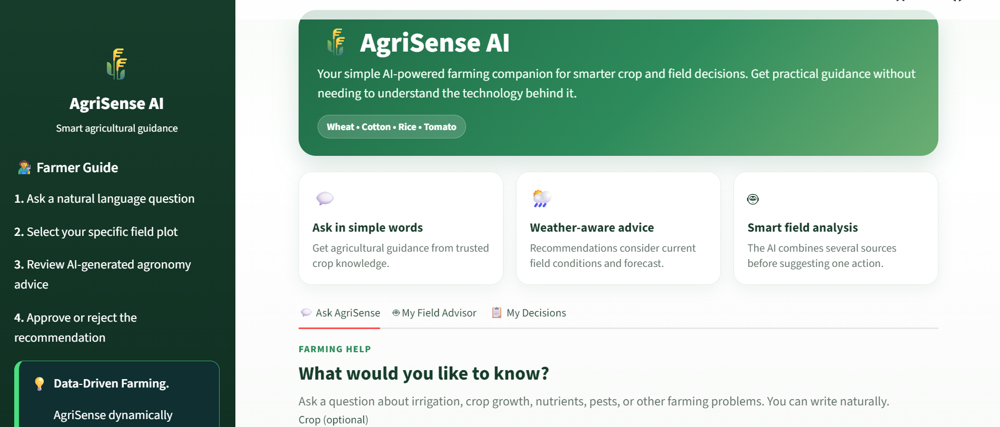
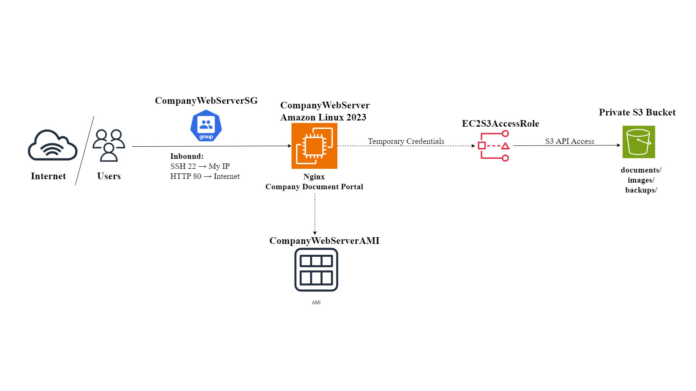

  

<h1 align="center">Abdul Rehman</h1>

<h3 align="center">
  Artificial Intelligence Undergraduate | Machine Learning | Deep Learning | NLP | Data Science
</h3>

  Building practical <strong>AI/ML systems, data-driven applications, and cloud-based solutions</strong> using Python.

<h3 align="center">🧭 Quick Navigation</h3>

  <a href="#what-i-build">What I Build</a> •
  <a href="#tech-stack">Tech Stack</a> •
  <a href="#featured-projects">Featured Projects</a> •
  <a href="#cloud--infrastructure">Cloud & Infrastructure</a> •
  <a href="#cv">CV</a> •
  <a href="#contact">Contact</a>

## What I Build

<table>
  <tr>
    <td width="48%" valign="top">
      <strong>🤖 <a href="#-customer-churn-prediction">Machine Learning Systems</a></strong>
       
      Predictive models and end-to-end ML applications.
    </td>
    <td width="4%"></td>
    <td width="48%" valign="top">
      <strong>🧠 <a href="#-agrofarm-ai">NLP & RAG Applications</a></strong>
       
      Natural language processing and retrieval-based AI solutions.
    </td>
  </tr>
  <tr>
    <td width="48%" valign="top">
      <strong>📊 <a href="#-e-commerce-sales--profitability-analysis">Data Analysis</a></strong>
       
      Exploratory analysis, visualization, and data-driven insights.
    </td>
    <td width="4%"></td>
    <td width="48%" valign="top">
      <strong>☁️ <a href="#cloud--infrastructure">Cloud & AWS Solutions</a></strong>
       
      Cloud-based infrastructure, deployment, and secure AWS environments.
    </td>
  </tr>
</table>

  • • •

## Tech Stack

<table>
  <tr>
    <td width="24%" valign="top"><strong>Languages</strong></td>
    <td width="76%" valign="top">Python • SQL</td>
  </tr>
  <tr>
    <td width="24%" valign="top"><strong>Machine Learning & Deep Learning</strong></td>
    <td width="76%" valign="top">Scikit-learn • TensorFlow • Predictive Modeling • Artificial Neural Networks</td>
  </tr>
  <tr>
    <td width="24%" valign="top"><strong>NLP & Generative AI</strong></td>
    <td width="76%" valign="top">NLTK • Hugging Face Transformers • RAG</td>
  </tr>
  <tr>
    <td width="24%" valign="top"><strong>Data & Analytics</strong></td>
    <td width="76%" valign="top">Pandas • NumPy • Matplotlib • Seaborn • Jupyter</td>
  </tr>
  <tr>
    <td width="24%" valign="top"><strong>Cloud & AWS</strong></td>
    <td width="76%" valign="top">AWS • Streamlit • Git • GitHub</td>
  </tr>
</table>

  • • • 

## Featured Projects

### 📈 [Customer Churn Prediction](https://github.com/abdulrehmanml/customer-churn-prediction-ml)

A machine learning application that estimates a customer's **likelihood of churn** from customer, service, contract, and billing information.

**Stack:** Python • Pandas • NumPy • Scikit-learn • Joblib • Streamlit

  <a href="https://github.com/abdulrehmanml/customer-churn-prediction-ml">Repository</a>
  &nbsp;•&nbsp;
  <a href="https://customer-churn-prediction-engine.streamlit.app/">Live Demo</a>

  

  
<strong>Technical Details</strong>

> **Pipeline:** Data Preprocessing → Feature Engineering → Model Training → Evaluation → Prediction
>
> **Core Tools:** Pandas • NumPy • Scikit-learn • Joblib • Streamlit
>
> **Application:** Customer information is processed through the trained ML pipeline to estimate churn likelihood.

---

### 🧠 [Sentiment Analysis System](https://github.com/abdulrehmanml/sentiment-analysis-system)

An end-to-end **3-class sentiment analysis system** for social-media text using NLP preprocessing, TF-IDF features, and machine learning.

**Stack:** Python • Scikit-learn • TF-IDF • Streamlit

  <a href="https://github.com/abdulrehmanml/sentiment-analysis-system">Repository</a>
  &nbsp;•&nbsp;
  <a href="https://sentiment-analysis-system-nlp.streamlit.app/">Live Demo</a>

  

  
<strong>Technical Details</strong>

> **Pipeline:** Text Preprocessing → TF-IDF → Model Training → Evaluation → Streamlit Deployment
>
> **NLP:** TF-IDF with unigrams and bigrams
>
> **Models:** Logistic Regression • Multinomial Naive Bayes
>
> **Classes:** Positive • Negative • Neutral

---

### 📊 [E-commerce Sales & Profitability Analysis](https://github.com/abdulrehmanml/ecommerce-sales-profitability-analysis)

An exploratory data analysis project focused on **sales, profitability, customer, product, regional, and discount-related patterns**.

**Stack:** Python • Pandas • NumPy • Matplotlib • Seaborn • Jupyter

  <a href="https://github.com/abdulrehmanml/ecommerce-sales-profitability-analysis">Repository</a>

  

---

### 🌱 [AgroFarm AI](https://github.com/abdulrehmanml/agrofarm-ai)

An agriculture advisory application combining **Generative AI, RAG, and Agentic AI** to provide grounded, field-aware farming guidance.

**Stack:** Python • Gemini • ChromaDB • RAG • Streamlit

  <a href="https://github.com/abdulrehmanml/agrofarm-ai">Repository</a>
  &nbsp;•&nbsp;
  <a href="https://agrofarm-ai.streamlit.app/">Live Demo</a>

  

  
<strong>Technical Details</strong>

> **Architecture:** Generative AI • RAG • Agentic AI
>
> **Core Components:** Gemini • ChromaDB • TF-IDF • Open-Meteo • Streamlit
>
> **RAG Flow:** User Question → Retrieval → Relevant Agronomy Context → Gemini → Grounded Answer
>
> **Agent Flow:** Field Data + Weather + RAG Knowledge → Gemini Reasoning → Recommendation → Human Approval
>
> **Controls:** Source Grounding • Human Approval • Decision Logging

  • • • 

## Cloud & Infrastructure

### ☁️ <a href="https://github.com/abdulrehmanml/aws-secure-web-hosting-infrastructure">AWS Secure Web Hosting & Cloud Storage Infrastructure</a>

A hands-on AWS infrastructure project focused on **secure web hosting, identity and access management, private cloud storage, backup, cost monitoring, and infrastructure troubleshooting**. :contentReference[oaicite:1]{index=1}

**Services:** Amazon EC2 • S3 • IAM • Security Groups • Nginx • AMI • AWS Budgets  
**Environment:** Amazon Linux 2023 • AWS CLI • Linux

  <a href="https://github.com/abdulrehmanml/aws-secure-web-hosting-infrastructure">Repository</a>
  &nbsp;•&nbsp;
  <a href="https://github.com/abdulrehmanml/aws-secure-web-hosting-infrastructure/tree/main/documentation">Documentation</a>

  

  EC2 Web Server • Nginx • IAM Role • Private S3 • AMI Backup • Security Controls

  
<strong>Technical Details</strong>

> **Infrastructure:** Amazon EC2 • S3 • IAM • Security Groups • Nginx • AMI • AWS Budgets
>
> **Environment:** Amazon Linux 2023 • Linux • AWS CLI
>
> **Architecture:** Internet → Security Group → EC2/Nginx → IAM Role → Private S3
>
> **Security:** MFA • Restricted SSH • S3 Block Public Access • IAM Role-Based Access
>
> **Validation:** IAM Policy Simulator • EC2-to-S3 Access Testing • Infrastructure Troubleshooting

  • • • 

## Additional Projects & Repositories

<table>
  <tr>
    <td width="48%" valign="top">
      <h3>🌐 <a href="https://github.com/abdulrehmanml/umt-login-page">UMT Login Page</a></h3>
      
HTML-based login page inspired by the UMT student portal interface.

      <a href="https://github.com/abdulrehmanml/umt-login-page">Repository</a>
      &nbsp;•&nbsp;
      <a href="https://abdulrehmanml.github.io/umt-login-page/">Live Demo</a>
    </td>
    <td width="4%"></td>
    <td width="48%" valign="top">
      
      <h3>📄 <a href="https://github.com/abdulrehmanml/abdul-rehman-cv">AI/ML Engineering CV</a></h3>
      
CV covering my academic background, technical skills, and selected AI/ML projects.

      

        <a href="https://github.com/abdulrehmanml/abdul-rehman-cv">Repository</a>
        &nbsp;•&nbsp;
        <a href="https://abdulrehmanml.github.io/abdul-rehman-cv/">View CV</a>
      

    </td>
  </tr>
</table>

  • • • 

## Currently Exploring

<table>
  <tr>
    <td width="48%" valign="top">
      <strong>⚙️ Production ML</strong>
       
      Model deployment, APIs, and production-oriented ML workflows.
    </td>
    <td width="4%"></td>
    <td width="48%" valign="top">
      <strong>🧠 LLM & RAG Applications</strong>
       
      Building retrieval-based AI applications and exploring LLM workflows.
    </td>
  </tr>
  <tr>
    <td width="48%" valign="top">
      <strong>🚀 Cloud Deployment</strong>
       
      Deploying AI/ML applications and services in cloud environments.
    </td>
    <td width="4%"></td>
    <td width="48%" valign="top">
      <strong>☁️ AWS Infrastructure</strong>
       
      Developing practical cloud infrastructure and strengthening AWS skills.
    </td>
  </tr>
</table>

  • • • 

<h2>Professional Links</h2>

  <a href="https://www.linkedin.com/in/abdul-rehmanmughal">LinkedIn</a>
  &nbsp;•&nbsp;
  <a href="mailto:hello.arehmanmughal@gmail.com">Email</a>

